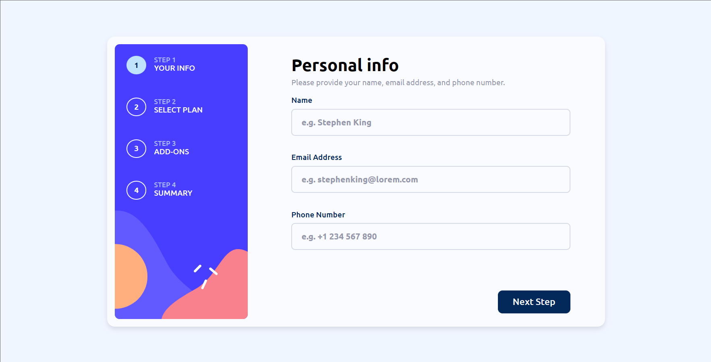

# Frontend Mentor - Multi-step form solution

This is a solution to the [Multi-step form challenge on Frontend Mentor](https://www.frontendmentor.io/challenges/multistep-form-YVAnSdqQBJ). Frontend Mentor challenges help you improve your coding skills by building realistic projects.

## Table of contents

- [Frontend Mentor - Multi-step form solution](#frontend-mentor---multi-step-form-solution)
  - [Table of contents](#table-of-contents)
  - [Overview](#overview)
    - [The challenge](#the-challenge)
    - [Screenshot](#screenshot)
    - [Links](#links)
  - [My process](#my-process)
    - [Built with](#built-with)
    - [What I learned](#what-i-learned)
    - [Useful resources](#useful-resources)
  - [Author](#author)

## Overview

### The challenge

Users should be able to:

- Complete each step of the sequence
- Go back to a previous step to update their selections
- See a summary of their selections on the final step and confirm their order
- View the optimal layout for the interface depending on their device's screen size
- See hover and focus states for all interactive elements on the page
- Receive form validation messages if:
  - A field has been missed
  - The email address is not formatted correctly
  - A step is submitted, but no selection has been made

### Screenshot

### Links

- Solution URL: [FrontendMentor_Multi-step-form-by-Catevika](https://github.com/Catevika/FrontendMentor_Multi-step-form-by-Catevika)
- Live Site URL: [frontendmentor-multi-step-form.netlify.app](https://frontendmentor-multi-step-form.netlify.app/)

## My process

### Built with

- React JSX
- CSS Flexbox & Grid
- Desktop-first workflow
- [Vite](https://vitejs.dev/) + React plugin
- [React-routeur-dom V6](https://reactrouter.com/en/main) - Client side routing for React

### What I learned

- React Context: state management
- CSS checkbox toggle: ssee Plan page
- CSS Custom checkbox: see Addons page
- Session storage for persistent states during session only: see Summary page
- React-routeur-dom Outlet: see Summary - Main replaced by Summary - Thanks after confirmation

### Useful resources

[CSS checkbox toggle](https://codepen.io/RobVermeer/pen/VaXYwj)

## Author

- English porfolio - [Catevika Portfolio EN](catevika.github.io/Catevika_Portfolio-EN/)
- French Portfolio - [Catevika Portfolio FR](catevika.github.io/Catevika_Portfolio-FR/)
- Frontend Mentor - [@Catevika](https://www.frontendmentor.io/profile/Catevika)
- Twitter - [@dominique_bello](https://twitter.com/dominique_bello)
